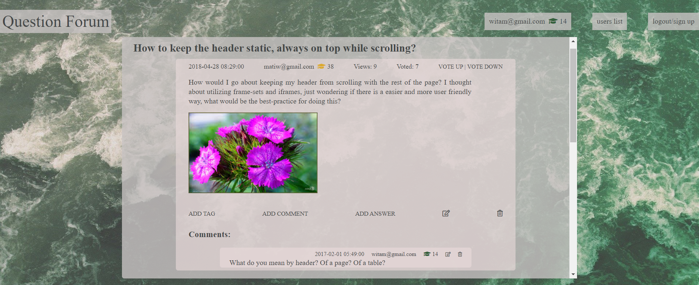

# AskMate (sprint 2)

_Project developed in October 2020. (Codecool course)_ 
_Developers: Ewa Żeleńska-Olczak, Joanna Rzeszótko-Doniec, Jakub Zieliński, Piotr Wójcik_

## Project assumptions

    - The application uses a PostgreSQL database instead of CSV files
    - User can add questions, answers and comments
    - User can vote up and down for questions, answers and comments
    - Basic options for sorting fitering and searching
    - Only logged users can edit / delete or mark answers as helpful one
    - There is a rating system for users according to their activity
    - Questions and answers have tags

